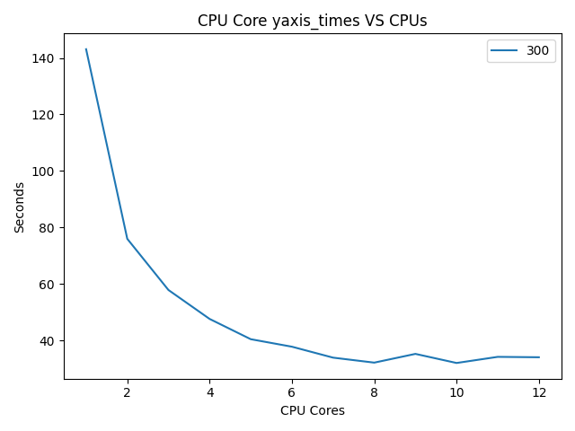

# 07 Prove: Video Frame Processing

## Overview

You will be finishing the coding of the video we did in class on Monday. If you missed class, you will need to watch the recording to obtain the code. Then you will be modifying it to run using a range of processes and plotting the results.

Download the [assignment.py](assignment.py) file and read the requirements.

## Project Description

Your program will need to process all 300 frames using starting with 1 CPU core. You will need to keep track of the time it took to process all of the frames.  (See the main code for the variables that will be used.)

Then, you will process all of the frames using 2 CPU cores and record the time it took.  Then 3 CPU cores, 4 CPU cores, etc... until you reach `CPU_COUNT` CPU cores.

On my computer, I have 8 CPU cores.  The const variable `CPU_COUNT` is set to 4 more the number of CPU cores on your computer.  So for me CPU_COUNT equals 12.  Here is a example of the plot that is created for 12 CPU cores. While your results might look slightly different, the general relationship should hold.

## Assignment

1. Download the [assignment.py](assignment.py) file.
2. Review the requirements and answer the questions at the top.

## Rubric

Item | Point Value
--- | ---
Runs without errors | 35
Plot produced | 35
Code will produce 300 frames that can be converted into a final video | 30

Assignments are not accepted late. Instead, you should submit what you have completed by the due date for partial credit.

Assignments are individual and not team based.  Any assignments found to be plagiarized will be graded according to the `ACADEMIC HONESTY` section in the syllabus. Personalize your code by adding comments explaining how your code works. This provides evidence that you wrote it yourself. You are allowed to work with other students, but your comments need to be in your own words.

## Submission

When finished, upload your assignment.py and signature files to Canvas (no zip files).
